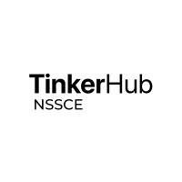
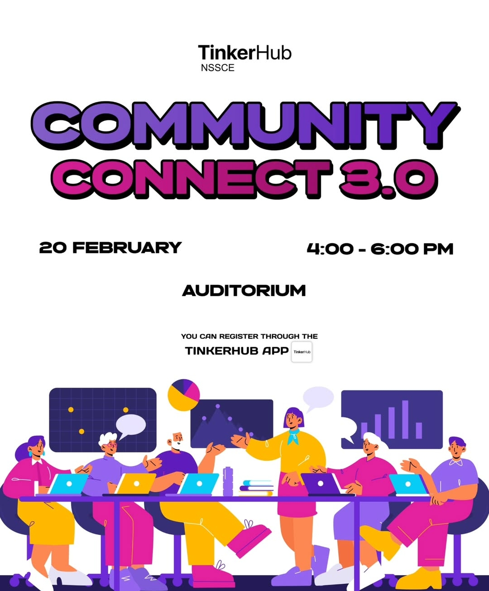

<!DOCTYPE html>
<html lang="en">
<head>
    <meta charset="UTF-8">
    <meta name="viewport" content="width=device-width, initial-scale=1.0">
    <title>Tinker Hub NSSCE</title>
    <link rel="stylesheet" href="style.css">
</head>
<body>
    <h1>TINKER HUB NSSCE</h1>
    <header>
        <nav class="navbar">
            <ul>
              
               <li><a href="contact.html">Contact</a></li>
               <li><a href="announcement.html">Announcement</a></li>
            </ul>
        </nav>
    </header>
     

    

        <h2><u><b>NSS COLLEGE OF ENGINEERING</b></u></h2>
        <h3>N S S College of Engineering, Palakkad is one of the most reputed, premier engineering educational institution in Kerala affiliated to APJ Abdul Kalam Technological University. It was established in 1960 by Nair Service Society under the leadership of late Bharatha Kesari Mannathu Padmanabhan, during the second five year plan with the assistance of the Central and State Government under the grant-in-aid scheme. The college has an enviable heritage and legacy of grooming brilliant engineering professionals who later made their mark in industrial and other sectors of the country and abroad. At present, the institution offers B.Tech degree courses in six branches and M.Tech degree courses in Communication Engineering, Power Electronics, Computer Science & Engineering, Structural Engineering, Computer Integrated Manufacturing, and Biomedical Engineering. The College is an approved research Place of APJ Abdul Kalam Technological University.
            Situated in NSS Nagar at Akathethara, 9 km from Palakkad town, the Campus is easily accessible, being only 4 km from the Palakkad Railway Junction, and is only 5 km from the renowned Malampuzha Gardens. Spread over 125 acres, the college includes an administrative block, separate blocks for each department, a library block and four hostels including one for ladies. Nestling among verdant foothills, the institution is a tranquil and serene setting for higher education.</h3>
           

            
           

        

        

        

            

                
            

        <pre>TinkerHub NSSCE, the non-profit founded in 2014, is an organization working in alignment with the sustainable development goals of quality education, decent work, and economic growth.

            Skill poverty has long-lasting repercussions in the Indian job environment where skill mismatch and underqualified graduates are the reasons for a massive unemployment rate. In a few years, unemployment is feared to become the cause of a greater economic disruption, with aftershocks that will have social, political, and economic dimensions.
            
            TinkerHub Foundation was born out of our understanding of the above. Today, the community hosts, co-hosts, and partners with learning initiatives all over the country. For the next two years, our goal is to enable industry-relevant technology education to over 10,000 students across 300 colleges.
            
            Learning Path is a virtual library with different paths or roadmaps listed, which a student can follow at any point in their journey of learning tech.</pre>    
        
            
        

    
</body>
</html>
<!DOCTYPE html>
<html lang="en">
<head>
    <meta charset="UTF-8">
    <meta name="viewport" content="width=device-width, initial-scale=1.0">
    <title>Announcement</title>
    
</head>
<body>
    

        

            
            
            
        

        

            <button class="nav-btn" id="prev">❮</button>
            <button class="nav-btn" id="next">❯</button>
        

    

    
</body>
</html>
<!DOCTYPE html>
<html lang="en">
<head>
    <meta charset="UTF-8">
    <meta name="viewport" content="width=device-width, initial-scale=1.0">
    <title>CONTACT</title>
    <link rel="stylesheet" href="style.css">
   

   

    <h1><u><b>Contact Us</b></u></h1>
   

   <pre id="contactwrite">"Connect with Us
    At Tinker Hub, innovation starts with collaboration. 
     Whether you’re brimming with ideas, need guidance, or are curious about what we do, we’d love to hear from you! Reach out to us through the contact form below, drop us an email, or connect with us on social med. 
      Together, let’s keep igniting creativity and building a vibrant tech community. Your thoughts and feedback are always welcome!"</pre>
   

   
   
   </head>
<body>
    
</body>
</html>
